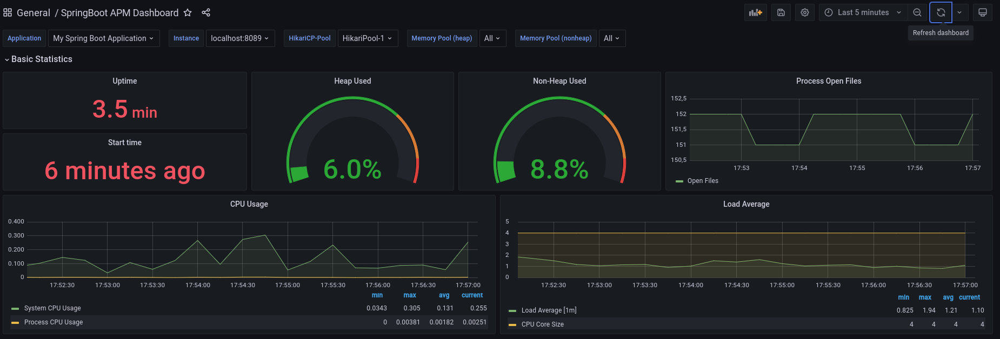
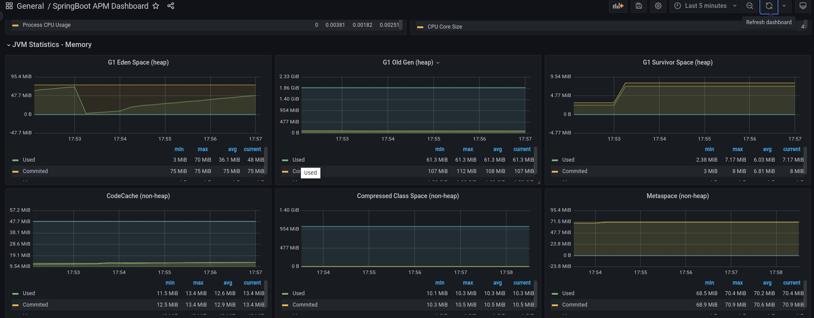
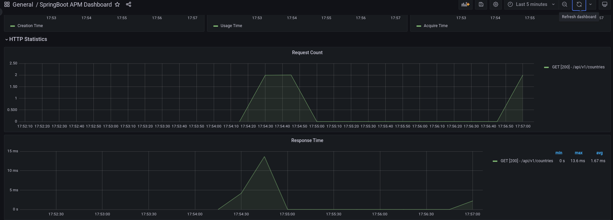
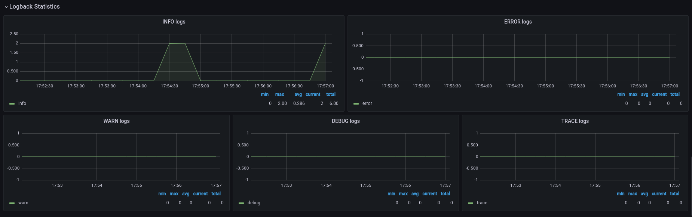
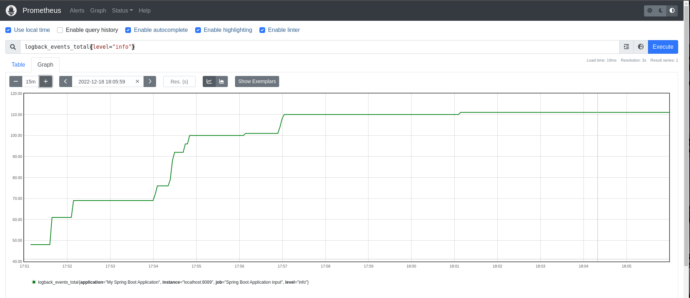
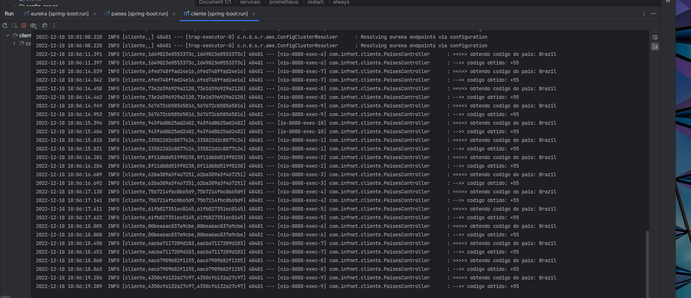
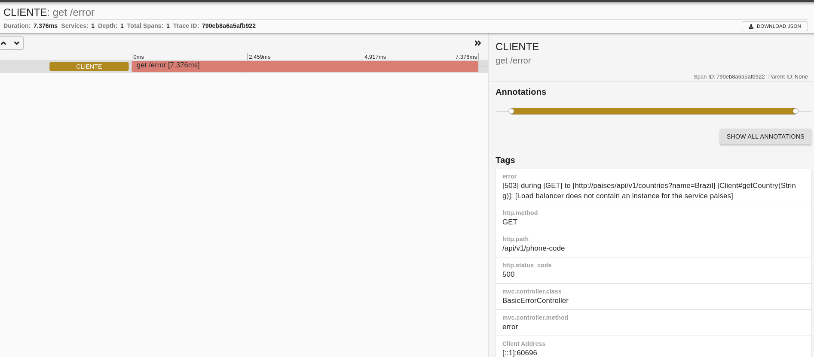
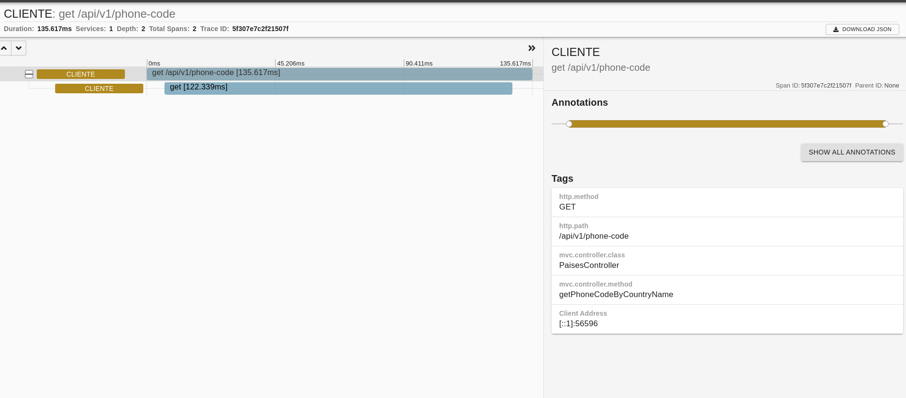

# Algumas instruções 

Quanto ao uso do Load Balancer, a documentação oficial relata que,
ao usarmos o OpenFeign numa aplicação, automaticamente as chamadas HTTP são
alvo de balanceadores de carga nativos, os quais por padrão usam o algoritmo **Round Robin** para
execução do balanceamento de carga. Mais detalhes estão presentes em https://docs.spring.io/spring-cloud-openfeign/docs/current/reference/html/#transform-the-load-balanced-http-request.

Para a execução do projeto, faça o seguinte:

Antes de mais nada, certifique-se de ter o Docker instalado em sua máquina.

1. entre no diretório da aplicação de nome "eureka" e seja via terminal ou via IDE,
execute `./mvnw spring-boot:run`. É necessário que o Service Discovery que aqui é o Eureka esteja
em execução primeiro.
2. entre no diretório da aplicação de nome "paises" e, no terminal, execute o comando
`docker-compose up -d` para executar o banco de dados e suas migrations. A seguir, execute `./mvnw spring-boot:run`.
3. entre no diretório da aplicação de nome "cliente" e execute `./mvnw spring-boot:run`.

Ao acessar o endereço `http://localhost:8088/swagger-ui.html`, você acessará a API cliente que
busca o código telefônico de um país passado por parâmetro.

Ao acessar o endereço `http://localhost:8089/swagger-ui.html`, você acessará a API paises que
fornece o código telefônico de um país passado por parâmetro.

Temos ainda implementados na aplicação:

## Monitoramento
Dashboard criado no Grafana para o microsserviço Países:

Logs do microsserviço países indexados no Prometheus.
Neste caso usou-se os logs do tipo "info"

Logs com Sleuth do microsserviço "cliente" no Zipkin:

Logs com Sleuth no microsserviço "Cliente"

## Algumas tecnologias usadas
- Docker compose
- PostgreSQL
- Flyway
- Prometheus
- Grafana
